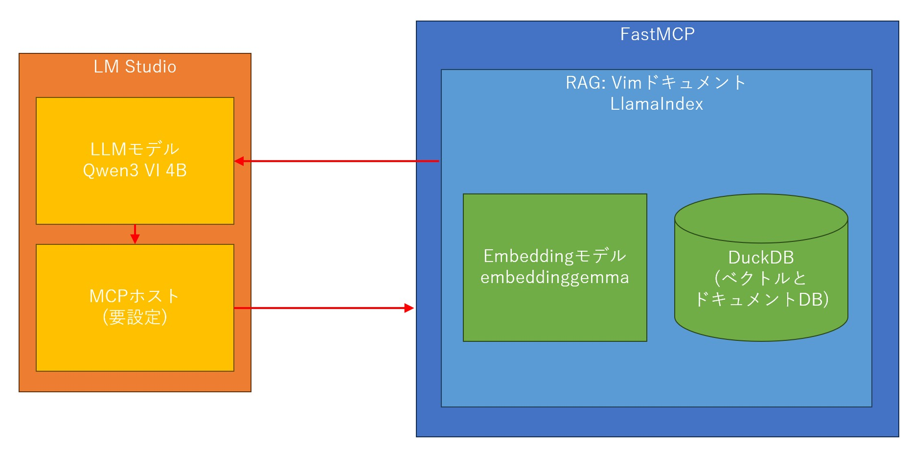
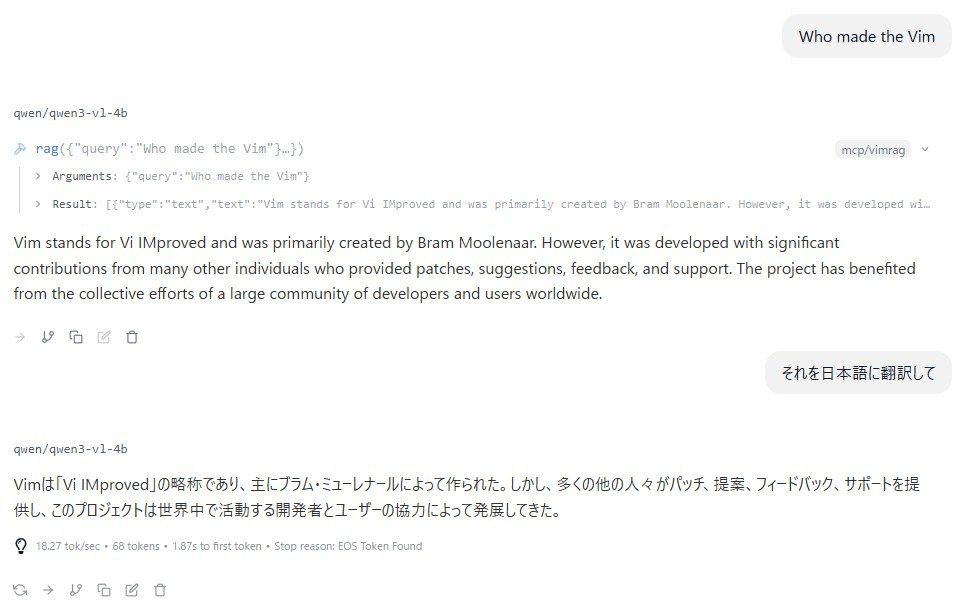

# RAGをMCPサーバー化し、LLMから利用する実験

## 概要

MCP (Model Context Protocol) はMCPホスト、MCPクライアント、MCPサーバーという3つのアクターから成る。
3つのアクターの概要は以下の通り。

*   MCPホスト: LLMモデルとMCPサーバーの仲立ちをする

    LLMの出力から、ツール(MCPサーバー)を必要とする内容を解釈して、
    MCPクライアントを用いて指定のMCPサーバーにリクエストを投げ、
    その応答をLLMモデルへ引き渡す。

    今回の実験ではこれに [LM Studio](https://lmstudio.ai/home) を用いた。
    LM Studio はMCPホストだけではなく、
    モデルマネージャー(モデルのダウンロードや切替を行う)やローカルLLMサービス、
    チャットインターフェースといった複合的な機能を提供している。

*   MCPクライアント: 標準の [JSON-RPC 2.0](https://www.jsonrpc.org/specification) を用いてMCPサーバーに接続しその機能を利用する

*   MCPサーバー: LLMに利用させたいツールなどの資源を提供するサーバー

    今回の実験では、前に構築したローカルRAGをMCPサーバーとしている。
    このローカルRAG自体がLLMを用いるモノなので、
    普通のMCPサーバー、例えばローカルでのgitレポジトリの操作を提供するようなものとは要件が異なり、
    また全体構成が複雑に見えいるので留意が必要。

システムの概要図は以下の通り。
LLMモデルがLM Studioのチャットと、RAGとで2通りの使われ方をしていることに要注意。



大まかなシーケンスはこうなる。

1.  ユーザーがLM Studioのチャットに入力
2.  LLMモデルがツール(MCPサーバー)の利用を伴う回答を生成
3.  LM StudioのMCPホスト機能がMCPクライアントを通じて、RAGのMCPサーバへリクエスト(クエリー)
4.  RAGがクエリーをembeddingし、ベクトルDBへ問い合わせ
5.  RAGが問い合わせ結果をまとめるようにLLMモデルへ要求 (今回はこのLLMがLM Studioにより管理されている)
6.  LLMモデル → RAG → MCPホスト → LLMモデル → ユーザー と、応答が呼出しを遡っていく

## RAGのMCP化

[FastMCP](https://gofastmcp.com/getting-started/welcome)を用いると、Pythonで書かれた関数が簡単にMCPサーバー化できる。

参考: [完成したソースコード](./server_rag_vimdoc.py)

MCPサーバーとして動かすのに必要な差分だけを抜粋するとこうなる。

```python
from fastmcp import FastMCP

# MCPサーバーを起動
mcp = FastMCP("Vimdoc RAG")

def rag_query(query):
    # TODO: ここでRAGのクエリエンジンにクエリーする

@mcp.tool
def rag(query: str) -> str:
    """Ask Vim's documentation RAG"""
    return rag_query(query)

if __name__ == "__main__":
    mcp.run()
```

大事なポイントは、ツールとして提供したい関数を `@mcp.toool` で修飾すること、
その関数の Docstring に関数が何をするものが自然言語で説明すること、
関数の引数名を意味・働きが類推できるものにすること。

起動は以下のコマンドでHTTPサーバーとする。
今回のRAGはEmbeddingにLLMベースの物を使うために起動時間が長くなる。
そのためMCPホスト内のプロセスとして利用をすると取り回しが悪くなりすぎる。
それを嫌ってMCPサーバーとした。

```
fastmcp run -t http server_rag_vimdoc.py
```

### その他の変更

細かい話として、
前までは llama.cpp で動くLLMモデルを利用していたが、
今回から LM Studio のLLMモデルに切り替わった。
そのためLLMの設定の部分が以下のように変わっている。

変更前:

```python
from llama_index.llms.llamafile import Llamafile
Settings.llm = Llamafile(base_url="http://localhost:8080", temperature=0, seed=0)
```

変更後:
```python
from llama_index.llms.lmstudio import LMStudio
Settings.llm = LMStudio(model_name="qwen/qwen3-vl-4b", request_timeout=120, temperature=0, seed=0)
```

これに伴い、追加のモジュールのインストールが必要となる。

```
pip install llama-index-llms-lmstudio
```

## LM Studio の設定

1.  UIレベルは Developer
1.  MCPを利用できるモデルはハンマーのアイコン≒ Tool Use が付いたもの

    今回はQwen3 Vl 4Bを利用する。

1.  Developer タブを開いて Server Settings から Serve on Local Networks を有効化
1.  Chat タブを開いて新しいチャットを開始し、右端の Program から Install ドロップダウンの Edit mcp.json を選択

    内容を以下のように編集する。前節で起動した MCP サーバーのURLを指定している。
    インプロセスMCPサーバーの場合はここが起動コマンドになる。

    ```json
    {
      "mcpServers": {
        "vimrag": {
          "url": "http://127.0.0.1:8000/mcp"
        }
      }
    }
    ```

1.  Integrations に mcp/vimrag が表示されるので、有効化
1.  チャットしてMCPが起動するのを確認する

    この時、Developerタブ内のログにて、RAGからLLMモデルが呼ばれ推論が行われているのが見える。

MCPが呼び出されているサンプル:


